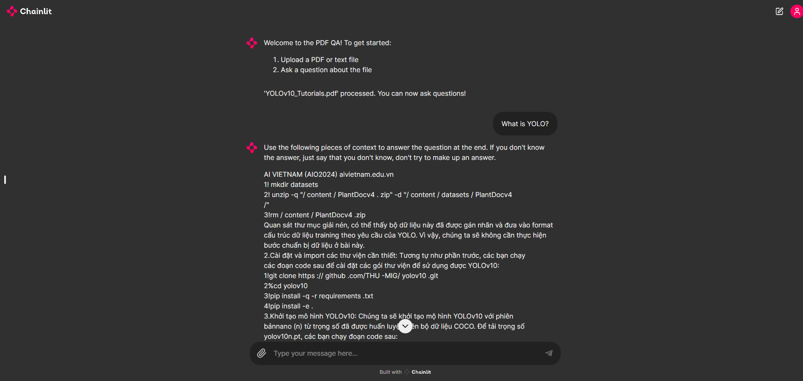

# **Question-Answering-PDF-wRAG**

This repository contains a project focused on implementing a question-answering system using RAG (Retrieval-Augmented Generation). The project leverages advanced machine learning techniques to provide accurate and efficient responses to user queries.

## **Directory Structure**

- `assets`: Demo images

- `data`: Directory for storing project data.

- `Question_Answering_Chainlit.ipynb`: Jupyter notebook for Chainlit-based question answering.

- `RAG_Question_Answering.ipynb`: Jupyter notebook for RAG-based question answering.

- `app.py`: The script to run the application using Ngrok.

## **Installation**
1. **Clone the Repository**
   ```bash
   git clone https://github.com/lbnm203/Question-Answering-wRAG.git

   cd Question-Answering-wRAG
   ```

3. **Install the required packages**:
    ```bash
    pip install -r <required-library> (all libraries in the first code block in Question_Answering_Chainlit.ipynb file)
    ```


## **Deployment**

To deploy the Question Answering with RAG using Chainlit, run the following command:

Using Google Colab and upload all the `Question_Answering_Chainlit.ipynb` and `app.py`, then:
### Using Tunnel
Run the relevant Tunnel code blocks in the `Question_Answering_Chainlit.ipynb` notebook to start the application via Tunnel.
### Using Ngrok
1. **Register/Login on [Ngrok](https://ngrok.com/) and get your TOKEN**
2. **Enter the token to `your-ngrok-token` in relevant Ngrok code blocks**

Run the relevant code blocks in the `Question_Answering_Chainlit.ipynb` notebook to start the application via Tunnel.


## **Demo**
<p align = 'center'>
   
</p>

## License
This project is licensed under the MIT License. See the LICENSE file for details.


### Notes:
- Update the installation instructions if there are any additional dependencies specific to your project.

This README provides a comprehensive guide for users to install dependencies, run the application, and understand the project structure.